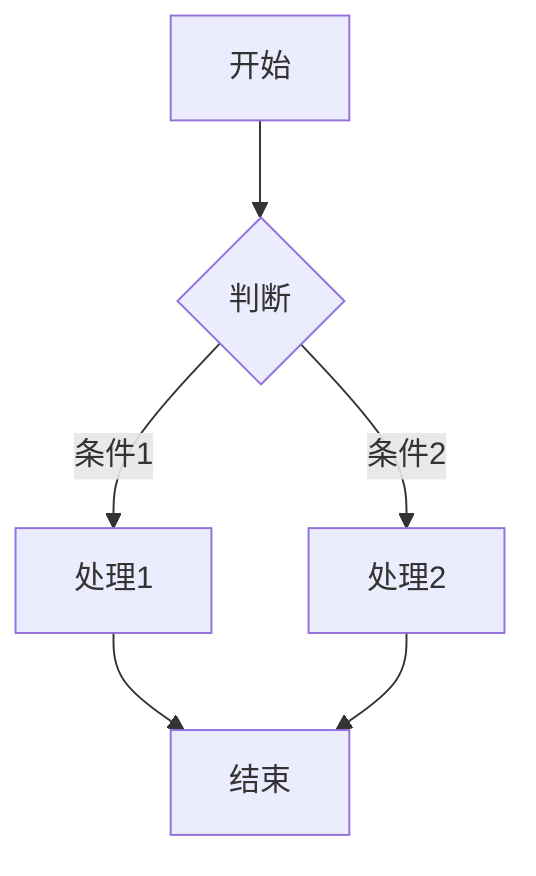

# 欢迎使用 Markdown 编辑器

这是一个 **完全在浏览器本地** 运行的 Markdown 编辑器：左侧编辑、右侧实时预览，草稿自动保存到 localStorage。

## 功能特性

- 📝 **实时预览** — 左侧编辑，右侧即时渲染
- 🌙 **深色模式** — 一键切换主题
- 💾 **自动保存** — 内容保存在浏览器本地
- 🎨 **代码高亮** — 支持多种编程语言
- 📊 **Mermaid 图表** — 流程图、时序图等
- 🧮 **数学公式** — 支持 KaTeX 渲染
- 📋 **目录生成** — 使用 [TOC] 插入目录

## 目录

[TOC]

## 语法示例

### 文本样式

**粗体**、*斜体*、~~删除线~~、==高亮==、`行内代码`

### 标题

不同数量的`#`可以完成不同的标题，如下：

```
# 一级标题

## 二级标题

### 三级标题
```

### 链接

对于该论述，欢迎读者查阅之前发过的文章，[你是《未来世界的幸存者》么？](https://mp.weixin.qq.com/s/s5IhxV2ooX3JN_X416nidA)
<a id="jump_8"></a>
### 图片

插入图片，格式如下：


### 无序列表

无序列表的使用，在符号`-`后加空格使用。如下：

- 无序列表 1
- 无序列表 2
- 无序列表 3

如果要控制列表的层级，则需要在符号`-`前使用空格。如下：

- 无序列表 1
- 无序列表 2
  - 无序列表 2.1
  - 无序列表 2.2


### 有序列表

有序列表的使用，在数字及符号`.`后加空格后输入内容，如下：

1. 有序列表 1
2. 有序列表 2
3. 有序列表 3

### 代码块

```javascript
function hello() {
  console.log('Hello, Markdown!');
}
```

### 任务列表

- [x] 已完成的项目
- [ ] 待办事项
- [ ] 另一个任务

### 表格

| 功能 | 状态 | 说明 |
|------|------|------|
| 实时预览 | ✅ | 左侧编辑右侧渲染 |
| 自动保存 | ✅ | localStorage 存储 |
| 导出文件 | ✅ | 支持 Markdown / HTML |

### 引用

> "Markdown 是一种轻量级标记语言，让你专注于写作本身。"

### 脚注

这里有一个脚注引用[^1]。

[^1]: 这是脚注的内容。

### 数学公式

行内公式：$E = mc^2$

块级公式：

$$
\int_{a}^{b} f(x) \, dx = F(b) - F(a)
$$

### Mermaid 图表



### Callout

> [!INFO]
> 这是一个信息提示框。

> [!WARNING]
> 这是一个警告提示框。

## 快捷键

| 快捷键 | 功能 |
|--------|------|
| Ctrl+B | 粗体 |
| Ctrl+I | 斜体 |
| Ctrl+K | 链接 |
| Ctrl+S | 手动保存 |
| Ctrl+/ | 注释 |

---

**开始你的写作之旅吧！** ✨
